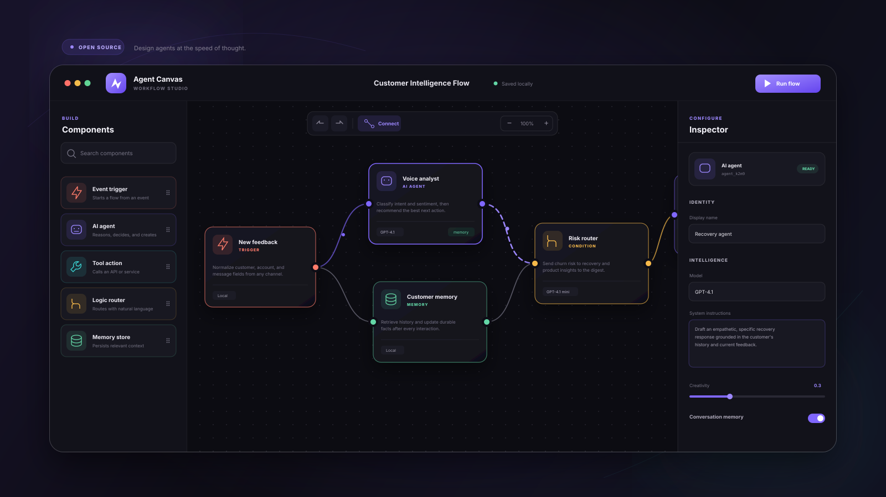
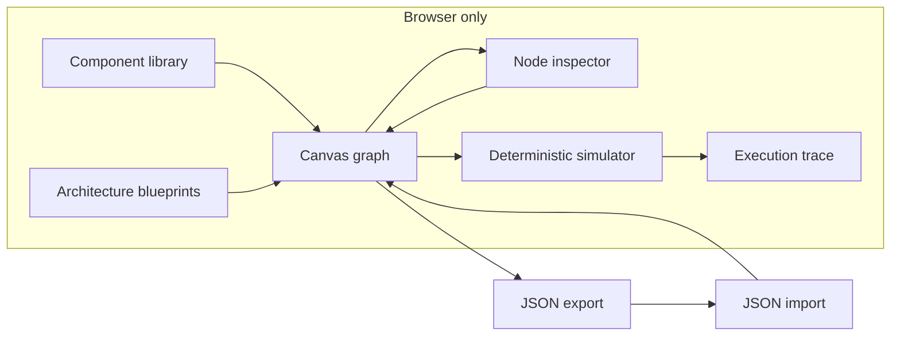

<div align="center">

# Agent Canvas

**A visual studio for designing AI agent systems at the speed of thought.**

Build multi-agent architectures, tune runtime behavior, simulate execution, and export a portable workflow—without installing a framework or creating an account.




[Explore the demo](#run-locally) · [See the features](#what-makes-it-special) · [Understand the design](#how-it-works)

</div>

---

> [!IMPORTANT]
> Agent Canvas is a deterministic browser **simulation** and architecture-design prototype. It makes no LLM, agent, tool, API, or network calls. Models and token counts shown in the interface are editable design metadata and synthetic run telemetry.

[Open the live studio ↗](https://harshareddy0405.github.io/agent-canvas/) · [Engineering notes](docs/ENGINEERING.md) · [Quality checks](https://github.com/harshareddy0405/agent-canvas/actions)

## Why Agent Canvas?

Agent systems become difficult to reason about the moment they grow beyond a prompt and a tool call. Agent Canvas makes the invisible visible: triggers, reasoning steps, tools, memory, routing logic, and outputs live together on one editable canvas.

This repository is a dependency-free product prototype built to explore what an approachable, design-led agent IDE could feel like.

## What makes it special

| Capability                        | What it unlocks                                                                                             |
| --------------------------------- | ----------------------------------------------------------------------------------------------------------- |
| **Visual workflow builder**       | Drag, position, connect, duplicate, and remove six purpose-built node types.                                |
| **Deep node inspector**           | Configure prompts, model choice, creativity, memory, streaming, and retry policy.                           |
| **Three architecture blueprints** | Launch customer intelligence, research swarm, and autonomous content patterns in one click.                 |
| **Live flow simulation**          | Watch nodes and edges execute in dependency order with timings, logs, steps, and token estimates.           |
| **Portable JSON**                 | Copy, download, and re-import a clean workflow schema for runtimes or version control.                      |
| **Thoughtful editing**            | Undo/redo, keyboard nudging, auto-layout, zoom, minimap, search, and connection selection.                  |
| **Local-first by default**        | Workspaces and theme preferences stay in the browser via `localStorage`. No telemetry.                      |
| **Designed for everyone**         | Responsive panels, visible focus states, semantic controls, reduced-motion support, and keyboard shortcuts. |

## Run locally

No packages, build tools, API keys, or accounts are required.

```bash
git clone https://github.com/harshareddy0405/agent-canvas.git
cd agent-canvas
python3 -m http.server 8080
```

Open [http://localhost:8080](http://localhost:8080). You can also open `index.html` directly in a modern browser.

## How it works



The application keeps a small normalized graph in memory:

```js
{
  projectName: "Customer Intelligence Flow",
  nodes: [
    { id, type, label, x, y, prompt, model, temperature, memory, stream, retries }
  ],
  edges: [
    { id, source, target }
  ]
}
```

The renderer projects that graph into accessible HTML nodes and SVG Bézier connections. The simulator performs a topological walk over the graph, animating each dependency and streaming structured events into the console. Every meaningful edit is captured in an in-memory history and debounced to browser storage.

## Interaction guide

- **Add:** click a component, or drag it from the library onto the canvas.
- **Connect:** click an output dot, then the target node's input dot.
- **Configure:** select a node and edit its settings in the Inspector.
- **Move precisely:** select a node and use the arrow keys; hold `Shift` for 1 px nudges.
- **Delete:** select a node or connection and press `Delete` / `Backspace`.
- **Duplicate:** press `⌘/Ctrl + D` on a selected node.
- **Search:** press `/` to jump to component search.
- **Run:** press `R`, or use **Run flow**.
- **Undo / redo:** use `⌘/Ctrl + Z` and `⌘/Ctrl + Shift + Z`.
- **Remove a connection:** double-click it, or select it and press `Delete`.

## Workflow components

| Node          | Role                                                                |
| ------------- | ------------------------------------------------------------------- |
| Event trigger | Starts a flow from an incoming event, webhook, or schedule.         |
| AI agent      | Reasons, transforms context, decides, and creates with an LLM.      |
| Tool action   | Represents an API, function, database, or external service call.    |
| Logic router  | Routes execution from natural-language or deterministic conditions. |
| Memory store  | Retrieves and persists durable context across steps.                |
| Output        | Formats and delivers the result to a person, channel, or system.    |

## Project structure

```text
agent-canvas/
├── assets/
│   └── cover.svg       # Repository hero artwork
├── index.html          # Semantic application shell
├── styles.css          # Responsive visual system and motion
├── app.js              # Graph editor, persistence, export, and simulator
├── LICENSE             # MIT License
└── README.md
```

## Design principles

1. **Show structure before complexity.** The graph is readable at a glance, while advanced configuration stays one selection away.
2. **Make every action feel consequential.** Connections glow, simulations travel through the graph, and edits acknowledge themselves.
3. **Be useful before setup.** A rich sample flow is ready on first load, and every feature works without a backend.
4. **Respect the user's work.** Local persistence and undo history make experimentation safe.

## Browser support

Agent Canvas targets current versions of Chrome, Edge, Firefox, and Safari. It uses modern browser APIs including native dialogs, CSS custom properties, SVG, pointer events, and `localStorage`.

## Privacy & local-first behavior

The application contains no analytics, trackers, third-party scripts, remote fonts, or network requests. Workflow edits are stored only in this browser under `agent-canvas.workspace.v1`; the theme uses `agent-canvas.theme`. Export and import happen only when you explicitly request them. Use browser storage controls to remove the saved workspace.

## Roadmap

- Runtime adapters for popular agent frameworks
- Custom tools and typed input/output contracts
- Collaborative cursors and workflow comments
- Execution traces connected to real model providers
- Shareable, read-only workflow presentations

## Contributing

Ideas and improvements are welcome. Keep additions dependency-light, accessible, and consistent with the local-first philosophy. For significant changes, open an issue describing the user problem before implementing a solution.

## License

Released under the [MIT License](LICENSE).

<div align="center">
  <sub>Designed and built as an exploration of calmer, more visual AI tooling.</sub>
</div>

## Built to be inspected

[](https://github.com/harshareddy0405/agent-canvas/actions/workflows/ci.yml)

The project includes versioned source, guarded local persistence, malformed-data recovery, product-specific interaction tests, and automated accessibility semantics checks. No API key is required to explore it.

```bash
# Optional development checks; the app itself needs no installation
npm ci --ignore-scripts
npm run check
npm test
npm run format:check
```

[Engineering notes](docs/ENGINEERING.md) · [Contributing](CONTRIBUTING.md) · [Security & privacy](SECURITY.md)

**Scope:** Provider names, model settings, latency, and token counts are design metadata or simulated values—not live inference.
